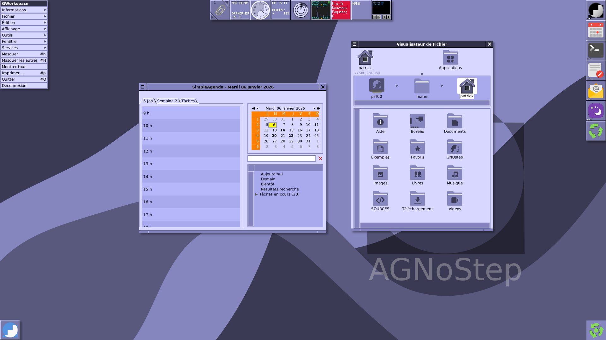

# agnostep-theme

GNUstep theme for the [AGNoStep Desktop Project](https://github.com/pcardona34/agnostep-desktop).

Although this theme was created with the AGNoStep Desktop Project in mind, it could be also used with any other GNUstep system already installed.
 
This theme was created mostly from the [Papirus Iconset](https://github.com/PapirusDevelopmentTeam/papirus-icon-theme.git).
New icons were created for some applications: Gorm, projectCenter...

The UI theme was inspired by the Sleek flat theme of GNUstep.

The color space (palette) was inspired from the classic OPENSTEP background. See details in AGNOSTEP_ART folder.

The default wallpapers were created on purpose: see Flavours below.  
Of course, you may change it with a picture of your own using the Preferences of GWorkspace.

AGNOSTEP-theme is under the [GPL License](LICENSE.txt).

- Release: see [RELEASE](RELEASE.txt).

## Goodies

The theme is also providing some usefull desktop tools:

- Time, date, Wheather health; CPU, Network and Memory monitoring.
- Birthday Notification.
- Updater: checking wether new Debian packages are upgradable...
- On laptops, a Battery monitoring.

## Two Flavours

AGNOSTEP-theme provides two flavours: *Conky* and *Classic* (c5c). In the two cases, the Workspace is handled by GWorkspace

### Conky Panel

- Wallpaper: Cubes and logos. It suggests GNUstep as a Workshop.

- All the monitoring tasks are provided within a Conky panel.

- The Clip (WMClip) and the Dock (WMDock) of Window Maker are hidden in favour of the Dock provided by GWorkspace Desktop at the left.

- Updater or Birthday notifications are provided threw Dunst notification messages.

### Classic

- Wallpaper: Waves with the palette theme for thi Classic flavour.

- Classic means we use tools provided by the Window Maker ecosystem. Namely, as an alternative to the Conky panel, the monitoring tasks are handled by dockapps.

- These dockapps are tied to WMClip (the Fiend of Window Maker) at the top.

- The Dock is also WMDock at the right side.

- Updates or Birthday notifications, date, uptime, Memory monitoring, Weather Health... are handled by instances of the dockapp 'wmtext' together with dedicated scripts. In the future, I hope to provide native docked GNUstep apps.

- We use also 'wmnd' (Network) and 'wmudmount' (mounting of removable medias).

- We use also some GNUstep docked apps: Time is shown by 'AClock'; CPU usage is monitored by 'TimeMon' (an OPENSTEP ported app).

- On laptops, Battery is monitored by the docked GNUstep 'batmon' app. 

I tried, when it was possible, to give those dockapps an unified appearence within the AGNOSTEP theme.

## How to install AGNOSTEP theme

### Within AGNoStep Desktop Project

If you yet installed the whole AGNoStep Desktop, this theme has been already set: see stage 6.

## Installing without AGNoStep Desktop

If not, you might first set a compliant GNUstep Desktop.

**IMPORTANT NOTE**
As the dependencies are managed with the apt command, you must use a compliant Operating System like GNU/Linux Debian Trixie. (If not, you must adapt all the dependencies. Do not hesitate to create a PR if you did it).

1) Install the Window manager Window Maker;

2) Install a complete GNUstep system with the frameworks (see  [agnostep](https://github.com/pcardona34/agnostep) for a complete list).

3) Install the Workspace (GWorkspace) and the mostly used GNUstep applications: namely AddressManager, GNUMail, SimpleAgenda, Ink, Terminal, InnerSpace...  
For the Classic Flavour (C5C) you will need also: AClock, TimeMon, batmon (laptop only).

4) Clone this repository:
````cd; mkdir SOURCES; cd SOURCES
    clone https://github.com/pcardona34/agnostep-theme
````
5) Enter in the subfolder `install` to run the installation of the theme.
````
    cd agnostep-theme
    cd install
    ./install_theme.sh
````
You will be asked for the Flavour (see above).
- Conky: it is the theme with the Conky panel.
- Classic (C5C): it is the theme with dockapps. 

You will also be asked for the Weather Station next to you to set the Weather info.

That's done. Enjoy!

## Screenshots



Some other screenshots are provided in the folder [Screenshots](Screenshots).

## How to uninstall

````
    cd agnostep-theme
    cd install
    ./uninstall_theme.sh
````
You will revert to the Default GNUstep Theme. If you were using another theme, change it with `SystemPreferences`: then Theme tab.
