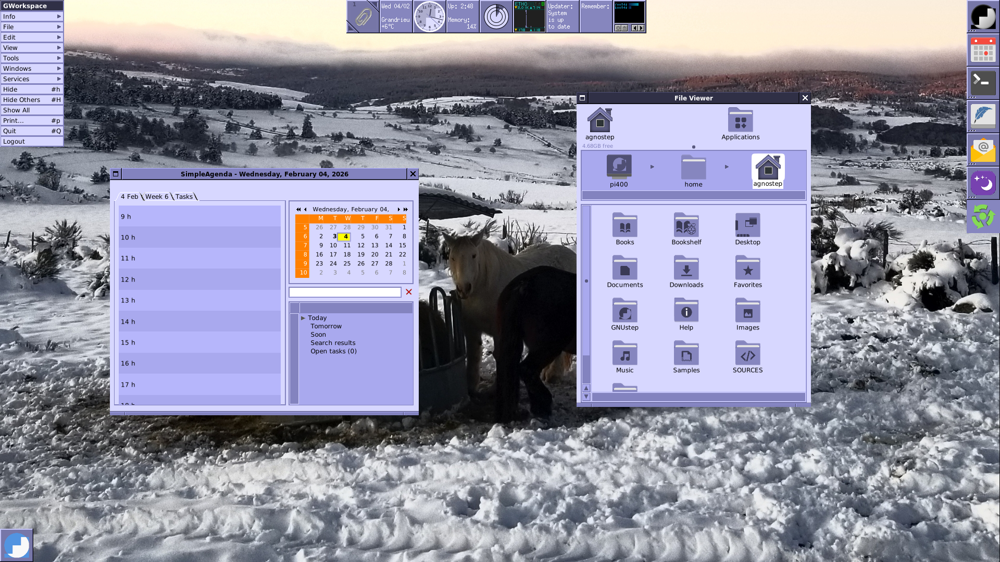
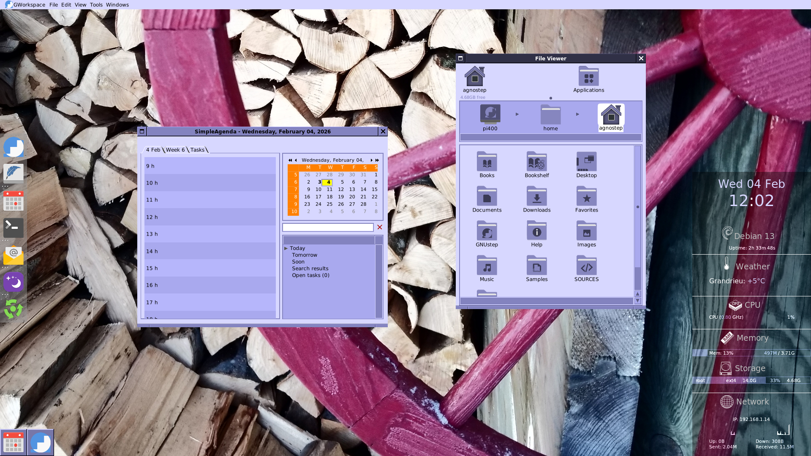

# agnostep-theme

GNUstep theme for the [AGNoStep Desktop Project](https://github.com/pcardona34/agnostep-desktop).

Although this theme was created with the AGNoStep Desktop Project in mind, it could be also used with any other GNUstep system already installed with a few tweaks. If you did, let me know.
 
This theme was created mostly from the [Papirus Iconset](https://github.com/PapirusDevelopmentTeam/papirus-icon-theme.git).
New icons were also created for some applications: Gorm, projectCenter...

The UI theme was inspired by the Sleek flat theme of GNUstep.

The color space (palette) was inspired from the classic OPENSTEP background. See details in the [AGNOSTEP_ART](AGNOSTEP_ART) folder.

The default wallpapers were created on purpose: see Flavours below.  
Of course, you may change it with a picture of your own using the Preferences of GWorkspace or using the Rotate Wallpapers tool with the provided collections: WINTER, WORLD...

AGNOSTEP-theme is under the [GPL License](LICENSE.txt).

- Release: see [RELEASE](RELEASE.txt).

## Two Flavours

AGNOSTEP-theme provides two flavours: *Conky* and *Classic* (alias *c5c*). In the two cases, the Workspace is handled by GWorkspace, the GNUstep Workspace manager.

### Screenshots

Below: AGNOSTEP-theme: Classic flavour. NeXT style menus. Rotate Wallpapers: WINTER collection.

Below: AGNOSTEP-theme: Conky flavour. Mac style menus. Rotate Wallpapers: WINTER collection.

Some other screenshots are provided in the folder [Screenshots](Screenshots).

### Conky Panel Flavour Details

- Wallpaper: Cubes and logos. It suggests GNUstep as a Workshop.

- All the monitoring tasks are provided within a Conky panel.

- The Clip (WMClip) and the Dock (WMDock) of Window Maker are hidden in favour of the Dock provided by GWorkspace Desktop at the left.

- Updater or Birthday notifications are provided threw Dunst notification messages.

### Classic Flavour Details

- Wallpaper: Waves with the palette theme for this Classic flavour.

- Classic means we use tools provided by the Window Maker ecosystem. Namely, as an alternative to the Conky panel, the monitoring tasks are handled by dockapps.

- These dockapps are tied to WMClip (the Fiend of Window Maker) at the top[^1].

[^1]: With the Mac style menus, the Clip will be set at the bottom of the screen.

- The Dock is also WMDock at the right side.

- Updates or Birthday notifications, date, uptime, Memory monitoring, Weather Health... are handled by instances of the dockapp 'wmtext' together with dedicated scripts. In the future, I hope to provide native docked GNUstep apps.

- We use also 'wmnd' (Network) and 'wmudmount' (mounting of removable medias).

- We use also some GNUstep docked apps: Time is shown by 'AClock'; CPU usage is monitored by 'TimeMon' (an OPENSTEP ported app).

- On laptops, Battery is monitored by the docked GNUstep 'batmon' app. 

I tried, when it was possible, to give those dockapps an unified appearence within the AGNOSTEP theme.

## Goodies

The theme is also providing some usefull desktop tools:

- Time, date, Wheather health; CPU, Network and Memory monitoring.
- Birthday Notification.
- Updater: checking wether Debian packages are upgradable...
- On laptops, a Battery monitoring.

## How to install AGNOSTEP-Theme?

See [INSTALL.md](INSTALL.md)...

